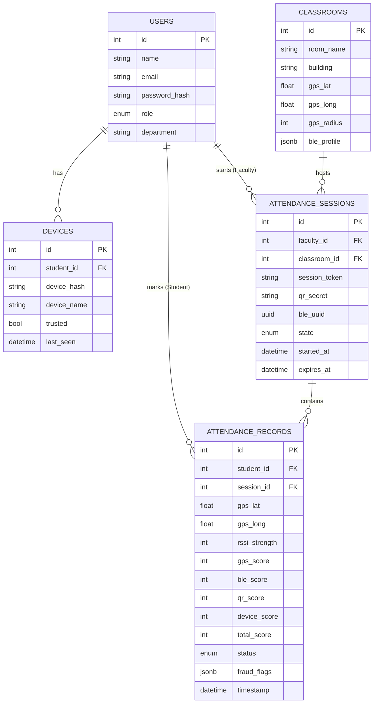

# Entity-Relationship Diagram

```mermaid
erDiagram
    USERS ||--o{ DEVICES : "has"
    USERS ||--o{ ATTENDANCE_SESSIONS : "starts (Faculty)"
    USERS ||--o{ ATTENDANCE_RECORDS : "marks (Student)"
    CLASSROOMS ||--o{ ATTENDANCE_SESSIONS : "hosts"
    ATTENDANCE_SESSIONS ||--o{ ATTENDANCE_RECORDS : "contains"

    USERS {
        int id PK
        string name
        string email
        string password_hash
        enum role
        string department
    }

    DEVICES {
        int id PK
        int student_id FK
        string device_hash
        string device_name
        bool trusted
        datetime last_seen
    }

    CLASSROOMS {
        int id PK
        string room_name
        string building
        float gps_lat
        float gps_long
        int gps_radius
        jsonb ble_profile
    }

    ATTENDANCE_SESSIONS {
        int id PK
        int faculty_id FK
        int classroom_id FK
        string session_token
        string qr_secret
        uuid ble_uuid
        enum state
        datetime started_at
        datetime expires_at
    }

    ATTENDANCE_RECORDS {
        int id PK
        int student_id FK
        int session_id FK
        float gps_lat
        float gps_long
        int rssi_strength
        int gps_score
        int ble_score
        int qr_score
        int device_score
        int total_score
        enum status
        jsonb fraud_flags
        datetime timestamp
    }
```
