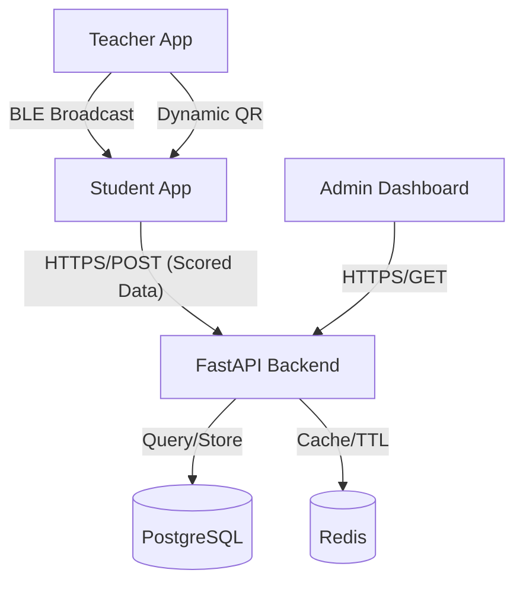

# System Architecture - Smart Attendance System

## Overview
The Smart Attendance System is a multi-factor validation platform that ensures students are physically present in the classroom during a session. It leverages BLE (Teacher Beacon), GPS (Geofencing), and Dynamic QR (Visual proof) to achieve high-integrity attendance records.

## Tech Stack
- **Frontend**: Flutter (Mobile App for Students and Teachers)
- **Backend**: FastAPI (Python)
- **Database**: PostgreSQL (Primary Relational Store)
- **Caching/Realtime**: Redis (Session management, Rate limiting, QR tokens)
- **Communication**: REST APIs & WebSockets (Real-time dashboard updates)

## Components

### 1. Teacher Mobile App
- **BLE Broadcaster**: Acts as a beacon with a unique session ID.
- **QR Generator**: Displays a dynamic QR code that rotates every 15-20 seconds.
- **Session Controller**: Allows starting, pausing, and ending attendance sessions.

### 2. Student Mobile App
- **QR Scanner**: Scans the dynamic QR from the teacher's screen.
- **BLE Scanner**: Scans for the teacher's beacon and reports RSSI (Signal Strength).
- **GPS Validator**: Checks if the device is within the campus/building geofence.
- **Device Fingerprinting**: Ensures one account is tied to one physical device.

### 3. FastAPI Backend
- **Validation Engine**: Implements confidence-based scoring.
- **Auth Service**: JWT-based authentication with device trust logic.
- **Session Manager**: Manages attendance session states in Redis and PostgreSQL.
- **Fraud Detection**: Simple rule-based logic to detect anomalies (e.g., impossible movement).

### 4. Infrastructure
- **Redis**: Stores active session nonces, active QR tokens, and rate limits.
- **PostgreSQL**: Stores user data, historical attendance records, and classroom metadata.

## Network Topology

