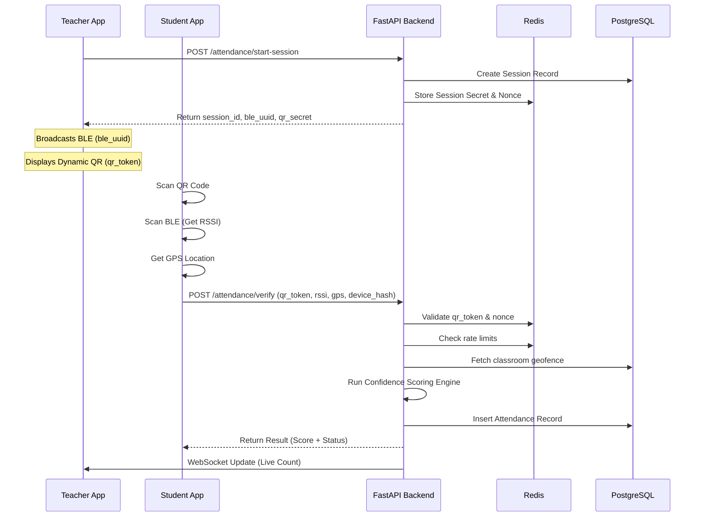
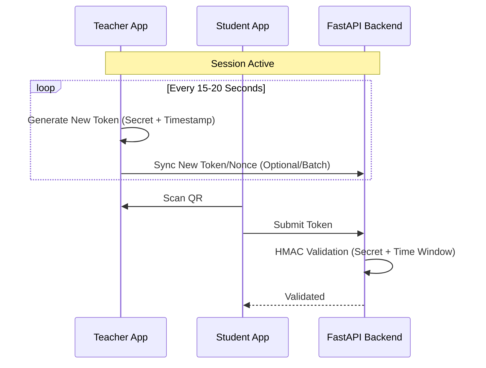
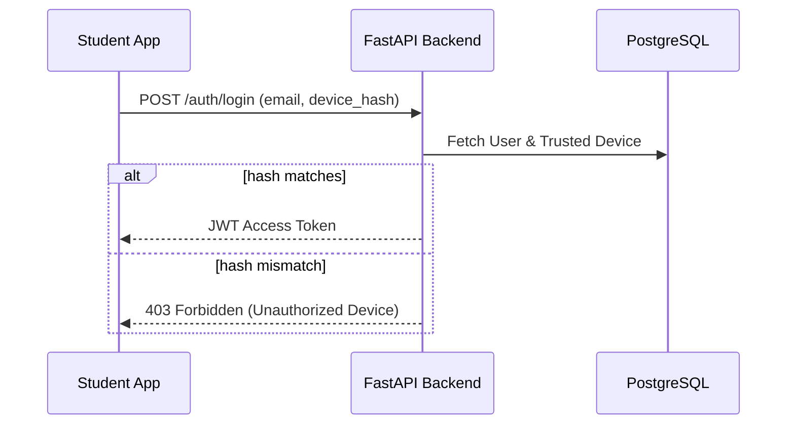

# Sequence Diagrams

## 1. Full Attendance Flow
This diagram illustrates the interaction between the Teacher App, Student App, and Backend during a standard attendance verification.

## 2. Dynamic QR Rotation
How the QR code updates without a backend hit for every student scan.

## 3. Device Fingerprinting & Auth
Preventing multiple devices for one account.

